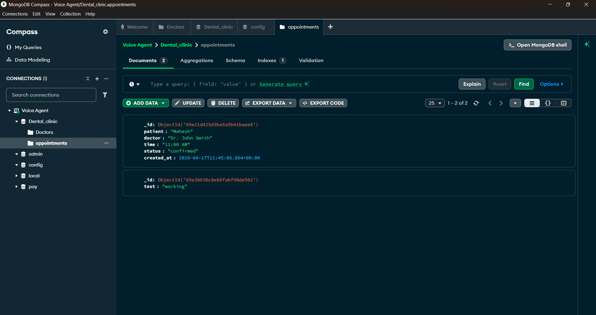

# Dental Voice Assistant Project

## Overview

This is a voice assistant application built with Python, designed to provide dental assistance through voice interactions. It integrates with Deepgram for speech recognition and synthesis, OpenAI for intelligent responses, and Twilio for real-time communication.


## 📞 How It Works

- User calls the Twilio number
- Voice is streamed to Deepgram for transcription
- OpenAI processes intent and decides actions
- Backend executes functions (recommend, book, etc.)
- Response is converted to speech and sent back


## 🛠️ Tech Stack

- Python (Async WebSockets)
- Twilio – Voice call handling
- Deepgram – Speech processing
- OpenAI (GPT) – AI reasoning & tool calling
- MongoDB – Database
- MongoDB Compass – Data visualization


## Features

- **Real-time Voice Interaction**: Handles incoming voice calls and responds with synthesized speech.
- **Dental Assistance**: Specialized prompts and functions for dental symptom assessment, dentist recommendations, and appointment booking.
- **WebSocket Communication**: Uses Twilio WebSockets for seamless audio streaming.
- **Configurable Settings**: Easily adjustable configuration via JSON file for audio, agent behavior, and API integrations.
- **Function Calling**: Supports predefined functions for dentist info, recommendations, appointments, etc.


## 🏗️ Architecture
User (Phone Call)
   ↓
Twilio (Media Stream)
   ↓
WebSocket Server (Python)
   ↓
Deepgram (Speech-to-Text & Text-to-Speech)
   ↓
LLM (Function Calling)
   ↓
Backend Functions (Booking Logic)
   ↓
MongoDB (Data Storage)

## Configuration

The `config.json` file contains all configurable settings:

- **Audio Settings**: Input/output encoding and sample rates.
- **Agent Settings**: Language, listening provider (Deepgram), thinking provider (OpenAI), speaking provider (Deepgram), and greeting message.
- **Functions**: Predefined functions for dental operations like getting dentist info, booking appointments, etc.


## Project Structure

```
voice-assistant/
├── main.py              # Main server script
├── dental_functions.py  # Dental-related functions
├── call.py              # Call handling script
├── mongoDb.py           # Database persistence and appointment storage
├── test.py              # Testing and validation scripts
├── config.json          # Configuration file
├── pyproject.toml       # Project dependencies
├── README.md            # This file
└── .env                 # Environment variables 
```

## Screenshots




## 📊 Example Flow

User: I have tooth pain
Assistant: I recommend Dr. John Smith
User: Book at 3 PM
Assistant: Appointment confirmed


## ⚠️ Notes

- Designed for demonstration and prototyping purposes


## Contributing

Contributions are welcome! Please fork the repository and submit a pull request.

## License

This project is licensed under the MIT License. See the LICENSE file for details.

